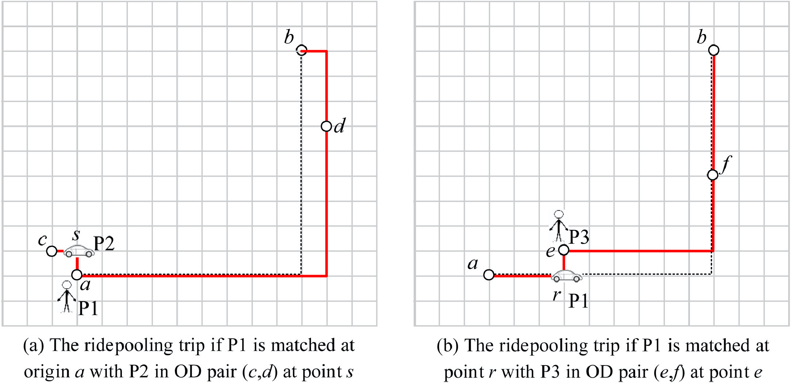
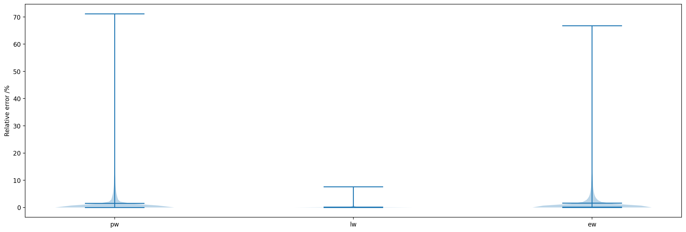
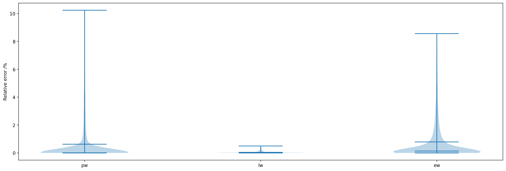
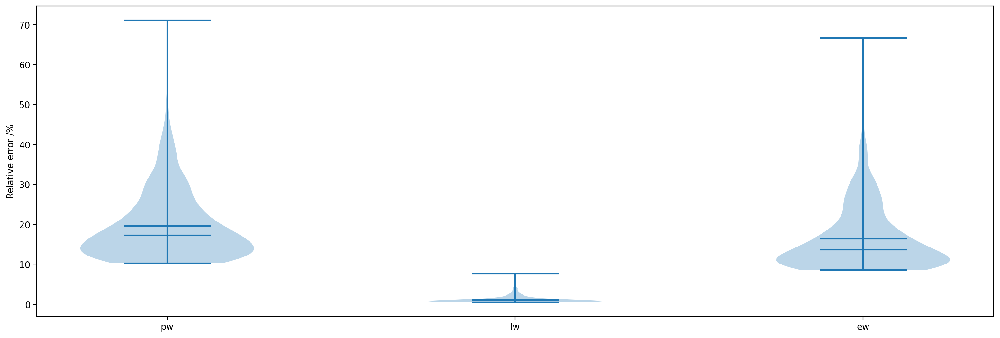

# Predicting the matching probability and the expected ride/shared distance for each dynamic ridepooling order in large scale (grid) network

## Prediction model

### Seekers and takers

### Prediction model

For each seeker-state:

- $p_{s(w)}$: probability of a seeker getting matched in this state.

For each taker-state:

- $p_{t(a, w)}$: probability of a taker getting matched in this state.
- $\lambda_{t(a, w)}$: arrival rate of unmatched passengers into this state.
- $\rho_{t(a, w)}$: probability of having at least one taker in this state.
- $\eta_{t(a, w)}$: aggregate arrival rate of matching opportunities for takers in this state.

For each match pair:
- $\eta_{t(a, w)}^{s(w)}$: mean arrival rate of matching opportunities in the seeker-state for takers in the taker-state.

There are complex interactions among these variables, so we formulated the interactions into a fixed point problem:
$$
F(\mathbf{X}) = \mathbf{X}, \mathbf{X} = (\mathbf{\lambda}, \mathbf{p_s}, \mathbf{p_t}, \mathbf{\rho}, \mathbf{\eta})^T
$$

### Pre-Experiments
Parameters:
- Pick-up time: 1s
- Maximum detour distance: 5m
- Search Radius: 5m
- Speed: 1m/s
- Demand rate of an OD: 0.5/s
- Simple fixed-point iteration method with stopping criteria $\Vert \mathbf{X}^{(k+1)} - \mathbf{X}^{(k)}\Vert_\infty \leq 1\%$

$$
\begin{matrix}
    \rm Network    & 30*30 & 180*180 & 180*180  \\ \hline
    \rm OD         & 300   & 2000    & 1e4      \\ \hline
    \rm Taker      & 5056  & 191956  & 9.5e5    \\ \hline
    \rm Match      & 32772 & 148530  & 3.6e6    \\ \hline
    \rm Iteration  & 29    & 20      & 25       \\ \hline
    \rm Step 0 / s & 0.488 & 108.342 & 2692.946 \\ \hline
    \rm Step 1 / s & 0.453 & 4.285   & 53.341   \\ \hline
\end{matrix}
$$

## Clustering

### Preliminaries

The *input* of spectral clustering is a **Similarity Matrix** $S\in \mathbb{S}^n$ and number of clusters $k$. Every element of the similarity matrix $w_{ij}$ measures the pairwise similarity between node $i$ and $j$ on a graph $G(V, E)$. Our *objective* is to minimize **RatioCut** or **Ncut**:
$$
    \mathrm{RatioCut}(A_1, \cdots, A_k) = \frac{1}{2}\sum\limits_{i=1}^k \frac{W(A_i, \overline{A_i})}{|A_i|}\\
    \mathrm{Ncut}(A_1, \cdots, A_k) = \frac{1}{2}\sum\limits_{i=1}^k \frac{W(A_i, \overline{A_i})}{\mathrm{vol}(A_i)}
$$

where $A_i$ denotes a set of nodes in the $i$th cluster, $\overline{A_i}$ denotes those are not in the cluster, $|A_i|$ denotes number of nodes in the $i$th cluser and:
$$
    \mathrm{vol}(A_i) = \sum\limits_{k \in A_i}\sum\limits_{j = 1}^n w_{kj}\\
  W(A, B) = \sum\limits_{i\in A, j\in B}w_{ij}
$$

### Minimize RatioCut approximately

Define $H\in \mathbb{R}^{n\times k}$ as an indicator matrix which indicates whether node $i$ belongs to cluster $j$. That is:
$$
  h_{ij} = \begin{cases}
      \frac{1}{\sqrt{|A_j|}}, v_i \in A_j\\
      0, \mathrm{otherwise}
  \end{cases}
$$
Then we can get that:
$$
\mathrm{RatioCut}(A_1, \cdots, A_k) = \mathbf{Tr}(H^TLH)
$$
where $L$ is the **Laplacian Matrix** of the graph:
$$
L = D - W = \mathbf{diag}(\sum\limits_{j=1}^n w_{1j}, \cdots, \sum\limits_{j=1}^n w_{nj}) - (w_{ij})_{n\times n}
$$
So the optimization problem is:
$$
  \min \mathbf{Tr}(H^TLH)\\
  \mathrm{s.t.\ } H = (h_{ij})_{n\times k}, h_{ij} = \begin{cases}
      \frac{1}{\sqrt{|A_j|}}, v_i \in A_j\\
      0, \mathrm{otherwise}
  \end{cases}
$$

This integer programming problem is a NP hard problem. But we can relax it by allowing $h_{ij}$ to take any real values. Then the relaxed problem becomes:
$$
    \min \mathbf{Tr}(H^TLH)\\
    \mathrm{s.t.\ } H^TH = I
$$
where $H^TH = I$ can be checked under our definition of $H$.

It is a standard **Trace Minimization Problem** and according to **Rayleigh-Ritz Theorem** the solution is given by choosing the first $k$ eigenvectors of $L$ as columns of $H$.

Finally, we should re-convert the real values of $H$ into discrete partition. Here we can use k-means algorithms on the rows of $H$.

### Experiments

We use spectral clustering to assign 10000 ODs on 360\*360 grid network into 5 clusters and each cluster has **2993, 624, 748, 2801, 2822** ODs respectively. The runtime for global variable-generation is **5549**s(92.5min) while the one for each cluster is **540, 31, 45, 459, 370**s(24.1min totally) respectively. The runtime for global iteration is **68**s while the one for each cluster is **17, 3, 4, 13, 14**s(51s totally) respectively when the absolute error $\epsilon = 10^{-4}$.

### Violin plot

